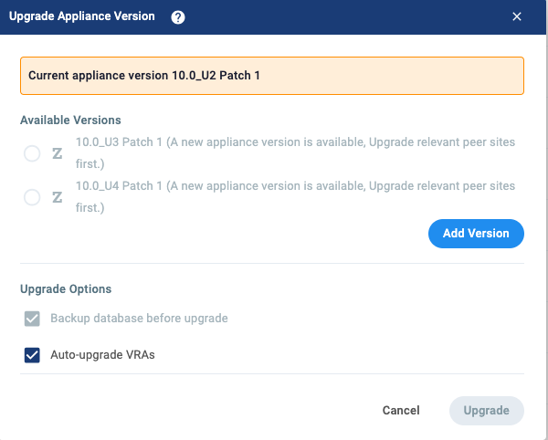
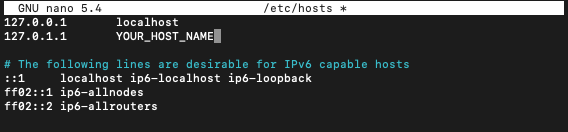

# Zerto ZVM Upgrade Documentation and Tutorial

This tutorial will walk you through the necessary steps to upgrade your current Windows ZVM to the latest Linux ZVM appliance, as well as updating your Linux ZVM post-migration.

Tonaquint requires your current Windows ZVM version to be 9.7 U4 (any patch) in order to follow along with this tutorial. If for some reason your site says you're on a different version, please upgrade your Windows ZVM to this point before proceeding.

For the migration process specifically we will be going from 9.7 U4 to 10.0 U2. Once all of our clients have reached this point, we will ask you to update your ZVM several more times at a later point in time to reach the latest version.

> [!IMPORTANT]
> Before proceeding, please consult with the [Zerto Compatibility Matrix](https://www.zerto.com/myzerto/support/interoperability-matrix/) to ensure that your environment is compatible with the upgrade process and all VRAs state they are on the latest version. If you are viewing this to upgrade your current Linux ZVM, please go to the [Upgrading The ZVM](#upgrading-the-zvm) section.

> [!CAUTION]
> This migration is only possible using vCenter and vCenter Cloud Director. If you are using a different VM platform this upgrade path **WILL NOT** be possible for you. Please contact Tonaquint to discuss possible solutions.

## Pre-Migration

Before we begin, there are a few considerations we must take into account:

* Please ensure your current Windows ZVM verision is at 9.7 U4 before proceeding.
* This is a full migration from Windows to Linux, and is achieved through the use of a migration tool that Zerto provides. The Windows ZVM can be decommissioned once the migration has been completed and verified.
* If your ZVM currently uses an external database you will need to ensure the Linux appliance can connect to it before beginning the migration. (Steps to verify are included here)
* There will be a total of three IPs needed as part of this migration. These must be in the same subnet and allow interconnectivity between them all.

### External Database Connection

Because of the change from Windows to Linux, we are unable to use Windows authentication for the database connection. A direct connection will need to be established instead using a local account. 

To determine if your ZVM was configured with an external database, follow these steps:

1. On your Windows ZVM, open the file `C:\Program Files\Zerto\Zerto Virtual Replication\storage_properties.xml`

2. If the value under **m_server** is similar to `\\.\pipe\LOCALDB#SHD79E11\tsql\query`, then you have an embedded database. You may skip to the next [section](#ip-addresses).
    - If the value is an FQDN or IP address, then your SQL database is externally hosted and you need to proceed with the next steps below.

If your ZVM does use an external database, you will need to log into your database as an administrator and ensure there is a local account with the System Administrator (SA) role and take note of its credentials.

You will then go into your current Windows ZVM and use the search bar near the start icon to look for "Zerto Diagnostic Tool.exe". Start this, then look for the "Change SQL Server Credentials" option.

> [!Note]
> The diagnostic tool can also be found at: `C:\Program Files\Zerto\Zerto Virtual Replication\Diagnostics\ZertoDiagnostics.exe`


Follow the steps and make sure that your Windows ZVM can connect using the SA credentials. Once verified, you may move on to the next step. If you cannot get this method to connect, you will need to revist the permissions associated with the local SA account for your database.

### IP Addresses

You will need a total of three IPs to perform the migration; the IP currently being used by the Windows ZVM, one for the Linux ZVM you will build here shortly, and a floater used during the migration.

These must all be in the same subnet and be allowed to connect to each other. Now is the time to ensure there are no firewall rules preventing communication within the subnet you plan to use. Consult your IP management data to avoid any conflicts. We also used the `ping` command to ensure no IP conflicts. 

Keep the IPs, gateway, subnet mask, and DNS somewhere close by as they'll be used shortly.

During the migration, the Linux ZVM will steal the Windows IP, then the Windows ZVM will be given the floater IP. The original Linux ZVM IP will no longer be used immediately after migration.

### Linux ZVM Setup

**The Linux ZVM appliance VM must be setup prior to using the migration tool.** This includes the following:

* Deploying the VM
* Setting up networking
* Enabling SSH

Deploying the VM is as simple as downloading the [Zerto 10.0 U2 ZVM OVF](https://fileshare.networksully.cloud/api/public/dl/7WW50bpd/zvml-build-fy23q4_p2-10.0.22.1064.zip), and deploying it as any other VM. Please contact Tonaquint if you would like additional assistance with deployment.

The deployment process may ask you to configure the VM's network as part of that process. If it does, you should be able to connect to the web UI right away. If not, you will need to take some additional steps outlined a bit further down in this section.

>[!WARNING]
> Zerto does not provide any guidance for changing VM properties such as CPU, memory, disk size, etc. Please do not change any of the preconfigured settings when deploying the OVF. If you have specific circumstances requiring a non-standard deployment, please reach out to Tonaquint before proceeding and they will contact Zerto support to provide a solution.

Once deployment is complete, you may power it on.

You may now connect to the ZVM in your web browser at  ht<span>tps://</span>ZVM-IP  to verify it was deployed correctly. The port :9669 is no longer needed.

The ZVM comes with a preconfigured user specifically for the ZVM:

* ZVM User/Password
    - admin
    - admin

You will be asked to change the default password when you first log in.

>[!NOTE]
> If you were not asked during deployment to configure network settings, you will need to follow the steps below. However, whether you can connect or not, you will want to double check your network settings before performing the migration by using number 1 in the below menu.

The VM comes with a preconfigured Linux user:

* Linux User/Password (Used for SSH)
    - zadmin
    - Zertodata123!


Open up a console for the VM and log in using the above credentials.
You will be asked to change the password before proceeding.

You will then be greeted by the appliance manager menu.


If you did not setup networking during deployment, this is where you will do it.

You will want to enter number 2, then 2 again to configure a static IP. Once finished, verify it can connect to the internet by entering 0 on the main manager menu to exit to shell, then use `ping google.com` to make sure packets are making it out to the internet and DNS is working correctly. It may take some time for the changes to take effect.

You can go back to the appliance manager menu from the shell by typing `app` and tab-completing to the `appliance-manager` command.

Next, enter number 7 and enable SSH.

>[!TIP]
> Now is a good time to ensure connectivity between this Linux VM and the Windows ZVM. First use `ping` to verify they can talk to each other, then use `ssh zadmin@ZVM-IP` in a terminal on the Windows ZVM to log in and confirm that SSH is enabled and working.

Your Linux ZVM appliance is now ready for migration.

>[!NOTE]
> It is highly suggested to also setup authentication through Keycloak at this point, but it is not required. See the [Authentication](#Authentication) section to see if your organization should leverage additional authentication methods.

## Migration Tool

>[!IMPORTANT]
> Before proceeding, please verify you have completed all of the [Pre-Migration](#pre-migration) steps to ensure the migration goes smoothly!

>[!IMPORTANT]
> This is where you will want to take snapshots of both the Windows and Linux ZVMs. ***We **HIGHLY RECOMMEND** taking snapshots!*** There is a process to restore the Windows ZVM in the event of failure, but a snapshot is much easier and more convenient.

You will want to download the [Zerto Migration Tool](https://f002.backblazeb2.com/file/TDC-ShareFiles/Zerto_Software/ZvmlMigrationTool_585.zip) onto the Windows ZVM.

Once downloaded, open the .exe and click on the "Read me" link that will open up the Zerto documentation. Once the page is launched, you can close it and proceed to the next screen in the tool.

Enter the Linux ZVM IP address, username, and password and validate SSH connectivity. Once validated, proceed to the next screen.


Next, you will need the network information for the floater IP address. Fill in the information and proceed.


Finally, you will be presented with a summary screen where you can verify all of the previous information you've entered. Please look over this and confirm the information you've entered before migrating. Once you begin the migration process there is no going back. You can also check the "Upgrade VRAs" box if you'd like, but in our experience we still had to manually update some of them. The migration should take around 20-30 minutes.


The IP change happens a minute or so into the migration and will cause you to disconnect if using RDP. If you want to continue monitoring it's progress you will need to log back in using the new floater IP.

If for any reason the migration is not able to proceed, it will preserve all original settings and allow you to fix whatever issues it found without affecting replication (minus the time it may have brought it down before it ran into an issue).

Return to the *Linux* ZVM web page, and verify that the migration was successful. It took roughly an hour for our VPGs to catch up, so don't worry if it's not immediately replicating. Also make sure to check that the VRAs on each host in the "Setup" tab are either updated or are updating. If they are not, please manually update them before proceeding.

## Authentication

Authentication is now handled through Keycloak, a third-party identity/security management platform baked into the ZVM appliance.

You can access Keycloak by going to https<span>://ZVM-IP</span>/auth

Preconfigured Keycloak User/Password:
* Keycloak
    - admin
    - admin

You will be required to change the password here upon first log in.

If you have simple access needs, i.e. you only have one or two individuals that need access, you can technically proceed with just the initial password change. The preconfigured account whose password you changed to access Keycloak can be sufficient for some organizations.

Our recommendation is that anyone that needs access should have their own user defined in Keycloak, even if that's just one or two people.

However, if you have a team of individuals that frequently access the ZVM, you may want to consider integrating your authentication system. This tutorial will provide instructions on how to integrate Active Directory, but you will need to consult the Zerto/Keycloak documentation if you have a different auth provider.

**The next section, however, is necessary reading for all organizations.**

### Admin Permissions

For reasons beyond understanding, Zerto has not included permissions for the preconfigured admin account to upgrade the ZVM. If you have attempted to update and are met with a flickering screen (it continually refreshes over and over) in the management console, this is why. 

Go to https<span>://ZVM-IP</span>/auth in your web browser and authenticate as the admin user. You will be required to change the password if you have not been to this page already.

Once here, you will need to change the Keycloak "Realm" in the top left to "zerto".


Next click on the "Users" tab, and search for "admin". Click into the admin user, and go to the "Role Mapping" tab.

Assign a new role, and then filter roles by client. Find "ZertoRole_Admin" and add it to the admin user. You may need to expand how many entries you can see on a page to find it. Your roles should look like below:


The admin account should now be able to access the "Appliance Upgrade" tab in the management console. 


### Active Directory Integration
> [!IMPORTANT]
> This section will require you to have some understanding of how your Active Directory is laid out. LDAP can be confusing, so don't hesitate to reach out to someone at Tonaquint if necessary.

You will need to have a few of things prior to starting the integration process:

* An AD service account that can be used to read groups and users
* A specific group or groups you want imported into Keycloak
* An AD server with LDAP enabled

Below are the necessary steps to connect Keycloak to your AD server:

1. Log into Keycloak by going to https<span>://ZVM-IP</span>/auth and logging in as admin.
    - Change the realm to "zerto"
    - Go to the "User Federation" tab
    - Add LDAP Provider
2. Input necessary connection information
    - Connection URL: ldap://Your_AD_Server_IP
    - Test connection. If it doesn't work, double check your IP/FQDN and that LDAP will work with your server
    - Bind Type: Simple
    - Bind DN: Common name of your service account
        - To find this, go to the attribute editor of your service account and find the "distinguishedName" field and copy it here. Ex. CN=service-bot,OU=ServiceAccounts,DC=example,DC=local
    - Bind credentials: Password of the service account
    - Test authentication. If it doesn't work either your password is wrong or the Bind DN is
3. Input necessary info to find users and groups
    - Edit mode: READ_ONLY
        - Please only use READ_ONLY, other values give Keycloak permission to write to your AD server (and that's bad)
    - Users DN: CN=Users,DC=example,DC=local
        - This is the distinguished name of the location where your users reside. You can use the attribute editor of a group to find the DN.
    - Search Scope: Subtree
    - Periodic full sync: ON
        - This will make it so Keycloak will scan for changes
    - Full sync period: 600
        - Scan interval
    - Save
4. Create LDAP Mappers
    - Click on the "Mappers" tab
    - Add login method mapper
        - Name: login method mapper
        - Mapper Type: hardcoded-attribute-mapper
        - User Model Attribute Name: loginMethod
        - Attribute Value: UserFederation
        - Save
    - Add groups-mapper mapper
        - Name: groups-mapper
        - Mapper-Type: group-ldap-mapper
        - LDAP Groups DN: CN=Users,DC=example,DC=local
            - Same as the Users DN from before
        - LDAP Filter: (CN=Your_Group)
            - This is the common name of your group. It does not need the full name, just the first bit with the group name.
            - If you want multiple groups, please use format: (|(group_1)(group_2)...)
        - Mode: READ_ONLY
        - User Groups Retrieve Strategy: LOAD_GROUPS_BY_MEMBER_ATTRIBUTE_RECURSIVELY
        - Save
5. Import users and groups into Keycloak
    - Go back to the screen where you input connection information and go to mappers tab
    - Click on the newly created "groups-mapper" mapper
    - Under the top right action drop down, choose "Sync LDAP groups to Keycloak"
        - It should say that your group or groups were imported
        - Verify they were imported by finding them in the "Groups" tab on the left
6. Give permissions to groups/users
    - Go to the Groups tab
    - Click on the group you want to change permissions
    - Under the "Role mapping" tab, assign a new role
        - Filter by client and find the "ZertoRole_Admin" role and assign it to the group
        - You can adjust what each group's permissions are by giving them different roles here
    - The process to grant permissions is the same for users
7. Change RBAC in management console
    - Go to https<span>://ZVM-IP</span>/management, and input admin credentials
    - Go to the "Security & RBAC" tab and change from "All Allowed" to "No Access"
        - This will guarantee that only those with assigned roles can sign in

Once these steps have been completed, you will want to test your credentials against the ZVM. If you can log in, then it worked! If it doesn't, you may need to double check the permissions of your service account you're using to connect to your AD server, the credentials you're using to test, the info you added from the above steps, or your group permissions within AD.
    

## Upgrading The ZVM

> [!IMPORTANT]
> Before proceeding, please ensure you have a snapshot of the Linux ZVM. This will help in the event you upgraded too far, or something went wrong. If you upgrade farther than instructed and you do not have a snapshot, you will be required to redeploy a brand new ZVM and will have to manually create each VPG again.

> [!IMPORTANT]
> If you are here to upgrade and haven't been following along with the tutorial, please check the [Admin Permissions](#admin-permissions) section and verify that you have set up your user roles correctly. The original admin user MUST have the correct permissions to upgrade the ZVM.

> [!CAUTION]
> Unless you have been instructed to upgrade to a higher version, PLEASE DO NOT PROCEED. Failure to follow these instructions will lead to loss of ZVM replication and the need to roll back to a previous version.

**From this point on, you should only proceed if you have been instructed to by Tonaquint staff.**

Zerto only allows upgrading up to two major versions away from your current version. For example, if you are on 10.0 U2 and want to reach 10.0 U5, you will first need to upgrade to either 10.0 U3 or U4 before you can upgrade to U5. 

This point is incredibly important, as this two-away versioning also applies to compatibility. If Tonaquint is on 10.0 U2 and you upgrade to 10.0 U5 (three major versions apart), replication will break and you will need to roll back your whole environment. The ZVM will typically prevent you from upgrading to an incompatible version, but in the case it doesn't it's important to know this information.

With Tonaquint's blessing, you may go to https<span>://ZVM-IP</span>/management and log in with your admin account's credentials. From here you will go to the "Appliance Upgrade" tab where it will likely tell you that you have a new version available.

You will see an upgrade button in the top right, click on it and you will see a list of available versions. Select the version that Tonaquint has asked you to upgrade to. You will want to ensure there is a Zerto "Z" next to the version you choose, then click "Upgrade". 



The ZVM will then begin the upgrade process. It will log you out from the management console multiple times, log back in to watch the progress of the upgrade.

Once the upgrade is finished, you will want to double check that your VRAs have all been updated or are currently updating. If they aren't, please start that process manually.


### ZVM Health Check

The Linux ZVM does not come with any out-of-the-box reporting on it's current status. There is the potential to have the ZVM running, but there be an issue with a VPG or VRA that wouldn't show up on a basic health check (like if you use `ping` for monitoring). Tonaquint has developed a simple service that can run on your ZVM that will periodically check the throughput of your sites and VPGs to ensure that the ZVM is running properly, and send you an email notification if it isn't.

While this service is not necessary, it can provide additional peace of mind knowing that your environment is working as intended.

You can find the installation instructions [**here**](https://github.com/DOGE28/Zerto-VPG-Checker-Linux/tree/Client)

### Troubleshooting

Below you'll find some issues that Tonaquint encountered when migrating from Windows to Linux, as well as their solutions. 

> [!IMPORTANT]
> This is where we once again instruct you to take a snapshot of the Linux ZVM, especially if it is currently replicating. We do not want you to have to manually reconfigure anything or have to start this process over.

***Not Enough Storage Error***

When attempting to upgrade your ZVM you may be met with an error stating there isn't enough storage space to download the update. This is most likely due to the old update not being removed, and usually happens while attempting to update from an intermediate version to the final target version. (10.0U2 -> 10.0U3 -X 10.0U5)

The solution involves using the Linux command line. If you are not comfortable with a CLI, either escalate this to someone who is, or contact Tonaquint and they can help guide you through the process. If you are comfortable, you may proceed with caution.

First we will need to do some investigating to find exactly where and what is taking up storage space.

1. SSH into the linux machine and exit to shell.

2. Use the `ls` command to list directories and find what is taking up the space.

```
cd /opt/zerto/zvr/upgrade-files && ls -h | grep bundle
```

This command will change directories to where the upgrade files are stored, then list all files and folders with "bundle" in the name, including their sizes (if over 1MB).

3. These are the leftovers of the previous upgrade and need to be removed. They will usually have part of the version in the name as well, so for example it may look similar (but not exactly) to "bundleXXX.10.0.20.XXX".

Then, use the below command, adjusted for your file, to remove it from the system.

```
sudo rm <your_file_to_delete>
```
You should be able to tab-complete the file so you don't have to type the whole name out.

If you get an error saying that the file is actually a folder, add a `-R` in front of `rm` and it will delete it.

> [!CAUTION]
> The -R flag means "recursive". It can and will delete anything and everything, including subfolders, in a given directory if used wrong. This command has no safety catches which is why we don't include it in the first command. If you accidentally type in the wrong directory here, it can be catastrophic. Another reason to take a snapshot!

Once these unecessary files have been deleted, you may try to upgrade again. If you continue to run into the same issue, please restart the entire VM and try again. If it still doesn't work, please contact Tonaquint and we will open a Zerto support ticket on your behalf.

***Flickering in the Management Console***

This will happen if you do not have the appropriate permissions set for your admin account when trying to access the "Application Upgrade" tab in the management console. Please refer to the [Admin Permissions](#admin-permissions) section to get this resolved.

***5XX HTTP Errors when attempting to reach ZVM web page***

There is a chance that when setting the host name using the appliance-manager, it doesn't get set properly. This will lead to HTTP 5XX errors supplied by Nginx. 
This typically means that the `hosts` file is not configured properly.

The `host_name` should be the same as the DNS record you intend to use. If you don't have a DNS record, or you aren't sure what to set it as, just copy the VM name within the hypervisor.

Running the below command will edit the `hosts` file, and change the host name (adjust for the host name you want to use). Your host name will not include a domain, Ex. `host_name` is correct, `host_name.example.com` is wrong and will cause additional issues.

```
sudo hostnamectl set-hostname YOUR_HOST_NAME
```

We then want to make sure it worked:

```
sudo nano /etc/hosts
```

Your file should look similar to this:



If it doesn't, change the second line to look like it does in the above photo (using your host name). Use `Ctl + X` then press 'Y' to save the changes and exit.

Return to the appliance manager by using the `appliance-manager` command, and select number 4: `Reboot Appliance`. Wait for it to come back up and see if the problem has cleared. If it has not cleared, double check that the host name change persisted through the reboot. If it looks right and it is still giving this error, contact Tonaquint to assist further.

***Unable to install VRA due to incompatibility issue (Despite the intercompatibility matrix stating it's compatible)***

If you run into an error looking like `VRA installation IP=X.X.X.X. Failed: One or more errors occurred. (ESX 80 update 3 is not supported. Latest supported ESX build is update 2. )` while attempting to install a VRA, yet you know that the version is listed as compatible on the [Zerto Compatibility Matrix](https://www.zerto.com/myzerto/support/interoperability-matrix/), please follow the below steps:

> [!CAUTION]
> Only follow these next steps if you are 100% confident that the version of Zerto that you're using is in fact compatible. Doing this wrong may cause stability and replication issues due to mismatched versions and the loss of site intercompatibility. 

On the CLI of the ZVM (log in via SSH or vSphere web console and use 0 to enter shell), run this command:

```
cat /var/data/zerto/zvr/zvm/vra/supported_updates.txt
```

You should see something like this:

```
ESX_67 4
ESX_70 3
ESX_80 2
...
```

You will need to change the line `ESX_80 2` to `ESX_80 3` (Or whatever version you're trying to add).

```
sudo nano /var/data/zerto/zvr/zvm/vra/supported_updates.txt
```

Exit by pressing `Ctrl + X` followed by `Y` to save your changes.

The change should be reflected immediately. If installing the VRA still fails, reboot the ZVM and try again.
If the problem is not fixed using this solution, please contact Tonaquint. We will need to engage Zerto support in order to find a fix.
