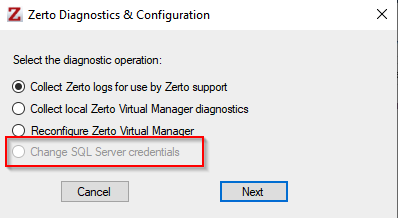

# Zerto ZVM Upgrade Documentation and Tutorial

This tutorial will walk you through the necessary steps to upgrade your current Windows ZVM to the newest Linux ZVM appliance.
The versions we suggest upgrading from/to is Zerto 9.7 U4 (any patch) to Zerto 10.0 U2. Zerto requires there be at most a two version gap when upgrading.

> [!IMPORTANT]
> Before proceeding, please consult with the [Zerto Compatibility Matrix](https://www.zerto.com/myzerto/support/interoperability-matrix/) to ensure that your environment is compatible with the upgrade process

## Pre-Migration

Before we begin, there are a few considerations we must take into account.

* This is a full migration from Windows to Linux. The Windows ZVM can be decommissioned once the migration has completed.
* If your ZVM currently uses an external database you will need to ensure the Linux appliance can connect to it before beginning the migration. (Steps to verify are included here)
* There will be a total of three IPs needed as part of this migration: the Windows ZVM, the Linux ZVM, and a floater used during the migration.

### External Database Connection

If your ZVM does not use an external database, you may skip to the next section.

If your ZVM does use an external database, you will need to log into your database as an administrator and ensure there is a local System Administrator (SA) account and take note of its credentials.

You will then go into your current Windows ZVM, then using the search bar near the start icon look for "Zerto Diagnostic Tool". Start this, then look for the "Change SQL Server Credentials" option.

> [!Note]
> The diagnostic tool can also be found at: `C:\Program Files\Zerto\Zerto Virtual Replication\Diagnostics\ ZertoDiagnostics.exe.`

