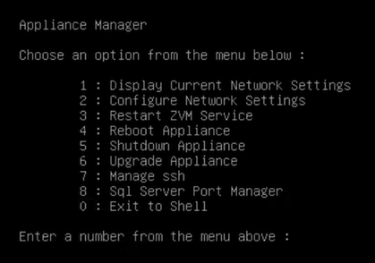
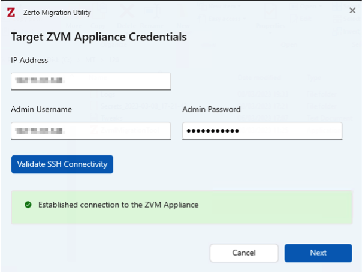
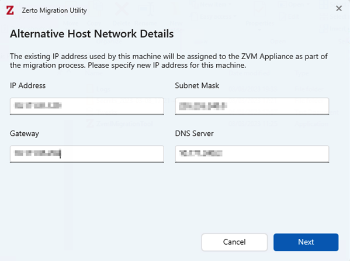
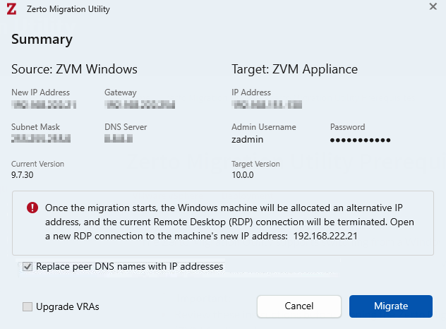
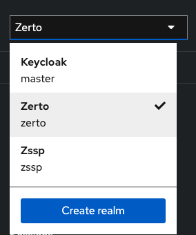
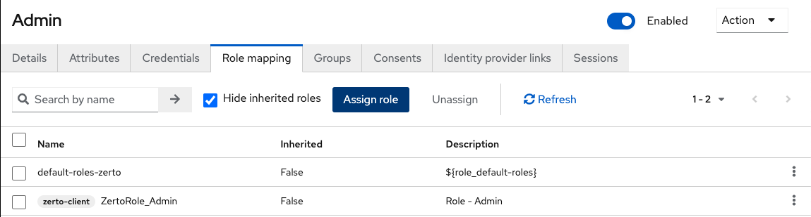

# Zerto ZVM Upgrade Documentation and Tutorial

This tutorial will walk you through the necessary steps to upgrade your current Windows ZVM to the latest Linux ZVM appliance.
The versions we suggest upgrading from/to is Zerto 9.7 U4 (any patch) to Zerto 10.0 U2. Zerto requires there be at most a two version gap when upgrading. Please upgrade your existing Windows ZVM to version 9.7 U4 before continuing.

If you are viewing this to upgrade your current Linux ZVM, please go to the [Upgrading The ZVM](#upgrading-the-zvm) section.

> [!IMPORTANT]
> Before proceeding, please consult with the [Zerto Compatibility Matrix](https://www.zerto.com/myzerto/support/interoperability-matrix/) to ensure that your environment is compatible with the upgrade process

> [!CAUTION]
> This migration is only possible using vCenter and vCenter Cloud Director. If you are using a different hypervisor, this upgrade path WILL NOT be possible for you. Additional platforms will be supported in future migration tool releases.

## Pre-Migration

Before we begin, there are a few considerations we must take into account.

* This is a full migration from Windows to Linux, and is achieved through the use of a migration tool that Zerto provides. The Windows ZVM can be decommissioned once the migration has been completed and verified.
* If your ZVM currently uses an external database you will need to ensure the Linux appliance can connect to it before beginning the migration. (Steps to verify are included here)
* There will be a total of three IPs needed as part of this migration. These must be in the same subnet and allow interconnectivity between them all.

### External Database Connection

If your ZVM does not use an external database, you may skip to the next section.

If your ZVM does use an external database, you will need to log into your database as an administrator and ensure there is a local account with the System Administrator (SA) role and take note of its credentials.

You will then go into your current Windows ZVM, then using the search bar near the start icon look for "Zerto Diagnostic Tool". Start this, then look for the "Change SQL Server Credentials" option.

> [!Note]
> The diagnostic tool can also be found at: `C:\Program Files\Zerto\Zerto Virtual Replication\Diagnostics\ ZertoDiagnostics.exe`


Follow the steps and make sure that your Windows ZVM can connect using the SA credentials. Once verified, you may move on to the next step. If you cannot get this method to connect, you will need to revist the permissions associated with the SA account.

### IP Addresses

You will need a total of three IPs to perform the migration; the IP currently being used by the Windows ZVM, one for the Linux ZVM, and a floater used during the migration.

These must all be in the same subnet and be allowed to connect to each other. Now is the time to ensure there are no firewall rules preventing communication within the subnet you plan to use. Consult your IP management data to avoid any conflicts. We also used the `ping` command to make sure that the IPs we wanted to use were not being used by another device before commiting to using them. 

>[!TIP]
> If you already have the Linux ZVM set up, you can run a `ping` command to ensure connectivity to the Windows ZVM.

Keep the IPs you've found somewhere close by as they'll be used shortly.

During the migration, the Linux ZVM will steal the Windows IP, then the Windows ZVM will be given the floater IP. The original Linux ZVM IP will no longer be used immediately after migration.

### Linux ZVM Setup

The Linux ZVM appliance VM must be setup prior to using the migration tool. This includes the following:

* Deploying the VM
* Setting up networking
* Making sure SSH is enabled

Deploying the VM is as simple as downloading the [Zerto 10.0 U2 ZVM OVF](https://www.zerto.com/myzerto/support/downloads/) from the support site, and deploying it as any other VM.

>[!WARNING]
> We choose not to change any of the preconfigured settings when deploying the OVF. If you do change anything please know that you are deviating from this tutorial and Zerto support may be the only ones that can fix any potential issues. Consult the Zerto documentation for options that are safe to change.

Once deployment is complete, you may power it on. 

You may now connect to the ZVM in your web browser at  ht<span>tps://</span>ZVM-IP  to verify it was deployed correctly. The port :9669 is no longer needed.

The ZVM comes with a preconfigured user specifically for the ZVM:

* ZVM User/Password
    - admin
    - admin

You will be asked to change the default password when you first log in.

>[!NOTE]
> If you are unable to reach the ZVM in the web browser, you will need to configure your networks settings. Whether you can connect or not, you will want to double check your network settings before performing the migration by using number 1 in the below menu.

The VM comes with a preconfigured Linux user:

* Linux User/Password (Used for SSH)
    - zadmin
    - Zertodata123!


Open up a console in the VM and log in using the above credentials.
You will be asked to change the password before proceeding.

You will then be greeted by the appliance manager menu.



You will want to enter number 2, then 2 again to configure a static IP. Fill out the necessary information and verify that it can connect to the internet. You can do this by entering 0 on the main manager menu to exit to shell, then use `ping google.com` to make sure packets are making it out to the internet and DNS is working correctly.

You can go back to the appliance manager menu from the shell by typing `app` and tab-completing to the `appliance-manager` command.

Next, enter number 7 and enable SSH. You will want to confirm that SSH is working by using the `ssh zadmin@<ZVM-IP>` command and logging in. If you ever need to change the password for this account in the future, you may exit to shell and use the `passwd` command to change it.

Your Linux ZVM appliance is now ready for migration.

>[!NOTE]
> It is highly suggested to also setup authentication through Keycloak at this point, but is not required. See the [Authentication](#Authentication) section for additional information.

## Migration Tool

>[!IMPORTANT]
> This is the point at which you will want to take snapshots of both the Windows and Linux ZVMs. We HIGHLY RECOMMEND taking snapshots! There is a process to restore the Windows ZVM in the event of failure, but a snapshot is much easier and more convenient.

You will want to download the [Zerto Migration Tool](https://www.zerto.com/myzerto/support/downloads/) onto the Windows ZVM. **Take care to choose the migration tool for the 10.0 U2 version!**

Once downloaded, open the .exe and click on the "Read me" link that will open up the Zerto documentation. Once the page is launched, you can proceed to the next screen.

Enter the Linux ZVM IP address, username, and password. Then validate SSH connectivity. Once validated, proceed to the next screen.



Next, you will need the network information for the floater IP address. Fill in the information and proceed.



Finally, you will be presented with a summary screen where you can verify all of the previous information you've entered. Please look over this and confirm the information you've entered before migrating. You can also check the "Upgrade VRAs" box if you'd like, but in our experience we still had to manually update them. The migration should take 10-20 minutes.



Return to the ZVM web page, and verify that the migration was successful. It took roughly an hour for our VPGs to return to full functionality, so give it some time. Also make sure to check on the VRAs on each host in the "Setup" tab are either updated or are updating. If they are not, please manually update them.

## Authentication

Authentication is now handled through Keycloak, a third-party identity/security management platform baked into the ZVM appliance.

You can access Keycloak by going to https<span>://ZVM-IP</span>/auth

Preconfigured Keycloak User/Password:
* Keycloak
    - admin
    - admin

You will be required to change the password here upon first log in.

If you have simple access needs, i.e. you only have one or two individuals that need access, you can technically proceed with just the initial password change. The preconfigured account whose password you changed at the ZVM web page can be sufficient for some organizations.

However, if you have a team of individuals that frequently access the ZVM, you may want to consider integrating your authentication system. This tutorial will provide instructions on how to integrate Active Directory, but you will need to consult the Zerto documentation if you have a different system.

The next section, however, is necessary reading for any organization.

### Admin Permissions

Before we proceed, we must first ensure that the preconfigured Admin account has the right permissions to upgrade the ZVM. This does not always come included as part of the installation process. 

Go to https<span>://ZVM-IP</span>/auth in your web browser and authenticate as the admin user. You will be required to change the password if you have not been to this page already.

Once here, you will need to change the Keycloak "Realm" in the top left to "zerto".



Next click on the "Users" tab, and search for "admin". Click into the admin user, and go to the "Role Mapping" tab.

Assign a new role, and then filter roles by client. Find the "ZertoRole_Admin" role and add it to the admin user. You may need to expand how many entries you can see on a page. Your roles should look like below:



The admin account should now be able to access the "Appliance Upgrade" tab in the management console. 


### Active Directory Integration
> [!IMPORTANT]
> This section will require you to have some understanding of how your Active Directory is laid out. LDAP can be confusing, so don't hesitate to reach out to someone at Tonaquint if necessary.

You will need to have a few things prior to starting the integration process:

* An AD service account that can be used to read groups and users
* A specific group or groups you want imported into Keycloak

Below are the necessary steps to connect Keycloak to your AD server:

1. Log into Keycloak by going to https<span>://ZVM-IP</span>/auth and logging in as admin.
    - Change the realm to "zerto"
    - Go to the "User Federation" tab
    - Add LDAP Provider
2. Input necessary connection information
    - Connection URL: ldap://Your_AD_Server_IP
    - Bind Type: Simple
    - Bind DN: Common name of your service account
        - To find this, go to the attribute editor of your service account and find the "distinguishedName" field and copy it here. Ex. CN=service-bot,OU=ServiceAccounts,DC=example,DC=local
    - Bind credentials: Password of the service account
    - Test authentication. If it doesn't work, either your password is wrong or the Bind DN is.
3. Input necessary info to find users and groups
    - Edit mode: READ_ONLY
        - If this is a different value, it gives Keycloak permission to edit your AD users. Don't let it do this! Keep it READ_ONLY
    - Users DN: DC=example,DC=local
        - This is all of the "DC's" of your AD server. Whatever DC's were on the end of the service bot's DN is what you'll put here. (This is the simple way of doing it)
    - Search Scope: Subtree
    - Periodic full sync: ON
        - This will make it so Keycloak will scan for changes
    - Full sync period: 600
        - Scan interval
    - Save
4. Create LDAP Mappers
    - Click on the "Mappers" tab
    - Add login method mapper
        - Name: login method mapper
        - Mapper Type: hardcoded-attribute-mapper
        - User Model Attribute Name: loginMethod
        - Attribute Value: UserFederation
        - Save
    - Add groups-mapper mapper
        - Name: groups-mapper
        - Mapper-Type: group-ldap-mapper
        - LDAP Groups DN: DC=example,DC=local
            - Same as the Users DN from before
        - LDAP Filter: (CN=Your_Group)
            - This is the common name of your group. It does not need the full name, just the first bit with the group name.
            - If you want multiple groups, please use format: (|(group_1)(group_2)...)
        - Mode: READ_ONLY
        - User Groups Retrieve Strategy: LOAD_GROUPS_BY_MEMBER_ATTRIBUTE_RECURSIVELY
        - Save
5. Import users and groups into Keycloak
    - Go back to the screen where you input connection information and go to mappers tab
    - Click on the newly created "groups-mapper" mapper
    - The top right action drop down, choose "Sync LDAP groups to Keycloak"
        - It should say that a group or groups were imported
6. Give permissions to groups/users
    - Go to the Groups tab
    - Click on the group you want to change permissions
    - Under the "Role mapping" tab, assign a new role
        - Filter by client and find the "ZertoRole_Admin" role and assign it to the group
        - You can adjust what each group's permissions are by giving them different roles here
    - The process to grant permissions is the same for users
7. Change RBAC in management console
    - Go to https<span>://ZVM-IP</span>/management, and input admin credentials
    - Go to the "Security & RBAC" tab and change from "All Allowed" to "No Access"
        - This will guarantee that only those with assigned roles can sign in

Once these steps have been completed, you will want to test your credentials against the ZVM. If you can log in, then it worked! If it doesn't, you may need to double check the permissions of your service account you're using to connect to your AD server, the credentials you're using to test, or your group permissions within AD.
    

## Upgrading The ZVM

> [!IMPORTANT]
> Before proceeding, please ensure you have a snapshot of the Linux ZVM. This will help in the event you upgraded too far, or something went wrong. If you upgrade farther than instructed and you do not have a snapshot, you will be required to redeploy a brand new ZVM and will have to manually create each VPG again.

> [!IMPORTANT]
> If you are here to upgrade and haven't been following along with the tutorial, please check the [Admin Permissions Section](#admin-permissions) and verify that you have set up your user roles correctly. The original admin user MUST have the correct permissions to upgrade the ZVM.

> [!CAUTION]
> Unless you have been instructed to upgrade to a higher version, PLEASE DO NOT PROCEED. Failure to follow these instructions will lead to loss of ZVM replication and the need to roll back to a previous version.

**From this point on, you should only proceed if you have been instructed to by Tonaquint staff.**

Zerto only allows upgrading up to two major versions away from your current version. For example, if you are on 10.0 U2 and want to reach 10.0 U5, you will first need to upgrade to either 10.0 U3 or U4 before you can upgrade to U5. 

This point is incredibly important, as this two-away versioning also applies to compatibility. If Tonaquint is on 10.0 U2 and you upgrade to 10.0 U5 (three major versions apart), replication will break and you will need to roll back your whole environment. The ZVM will typically prevent you from upgrading to an incompatible version, but in the case it doesn't it's important to know this information.

With Tonaquint's permission, you may go to https<span>://ZVM-IP</span>/management and log in with your admin account's credentials. From here you will go to the "Appliance Upgrade" tab where it will likely tell you that you have a new version available.

You will see an upgrade button in the top right, click on it and you will see a list of available versions. Select the version that Tonaquint has asked you to upgrade to. You will want to ensure there is a Zerto "Z" next to the version you choose, then click "Upgrade". 

The ZVM will then begin the upgrade process. I will unauthenticate you from the management console multiple times. You can simply log back in to watch the progress of the upgrade.

Once the upgrade is finished, you will want to double check that your VRAs have all been updated or are currently updating. If they aren't, please start that process manually.

### Troubleshooting

> [!IMPORTANT]
> This is where we once again instruct you to take a snapshot of the Linux ZVM, especially if it is currently working. We do not want you to have to manually reconfigure anything or have to start this process over.

***Not Enough Storage Error***

When attempting to upgrade your ZVM you may be met with an error stating there isn't enough storage space to download the update. This is most likely due to the old update not being removed, and would most likely happen while attempting to update from an intermediate version to the final target version.

The solution involves using the Linux command line. If you are not comfortable with a CLI, either escalate this to someone who is, or contact Tonaquint and they can help guide you through the process. If you are comfortable, you may proceed with caution.

First we will need to do some investigating to find exactly where and what is taking up storage space.

1. SSH into the linux machine and exit to shell.

2. Use the `ls` command to list directories and find what is taking up the space.

```
cd /opt/zerto/zvr/upgrade-files && ls -h
```

This command will change directories to where the upgrade files are stored, then list all files and folders including their sizes.

3. Look for any files that include "bundle" in the name. These are the leftovers of the previous upgrade and need to be removed. They will usually have part of the version in the name as well, so for example it may look similar (but not exactly) to "bundleXXX.10.0.20.XXX".

Then, use the below command, adjusted for your file, to remove it from the system.

```
sudo rm <your_file_to_delete>
```
You should be able to tab-complete the file so you don't have to type the whole name out.

If you get an error saying that the file is actually a folder, add a `-R` in front of `rm` and it will delete it.

> [!CAUTION]
> The -R flag means "recursive". It can and will delete anything and everything, including subfolders, in a given directory if used wrong. This command has no safety catches. If you accidentally type in the wrong directory here, it can be catastrophic. Another reason to take a snapshot!

Once these unecessary files have been deleted, you may try to upgrade again. If you continue to run into the same issue, please restart the entire VM and try again. If it still doesn't work, please contact Tonaquint and we will open a Zerto support ticket on your behalf.

***Flickering in the Management Console***

This will happen if you do not have the appropriate permissions set for your admin account when trying to access the "Application Upgrade" tab in the management console. Please refer to the [Admin Permissions](#admin-permissions) section to get this resolved.


